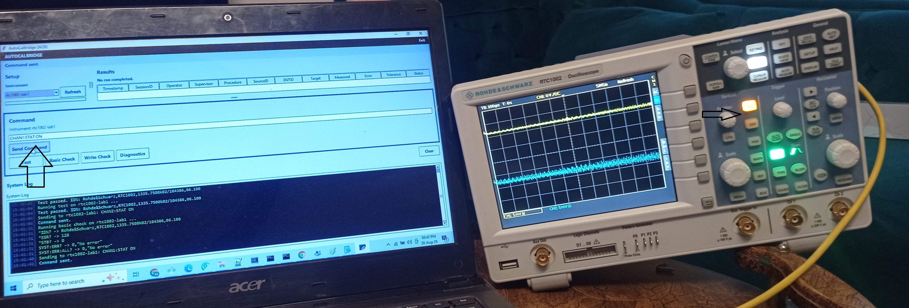
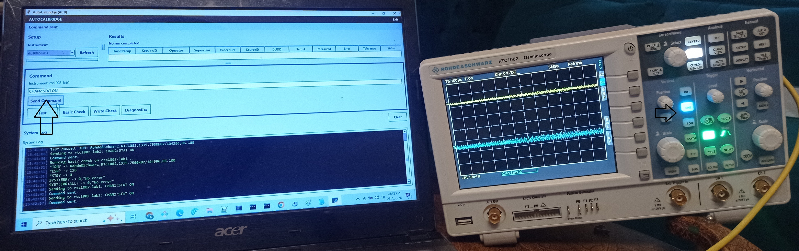

# AutoCalBridge (ACB)

**Automated Calibration for Multi-Vendor Instruments**

[](https://opensource.org/licenses/MIT)
[](https://www.python.org/downloads/)
[]()

> Core calibration engine complete and physically verified · GUI in active development

---

## What it is

AutoCalBridge is a standalone Windows application for automated calibration of multi-vendor measurement instruments. It provides a unified interface for controlling instruments from Keysight, Rohde & Schwarz, Rigol, Tektronix, and Keithley — over LAN, USB, or GPIB — without writing a line of code per instrument. Configuration is external; procedures are file-driven; reports carry full audit traceability.

The primary use case is two-ended calibration: a reference standard (source) and a unit under test (DUT) are controlled simultaneously, measurements are compared against defined tolerances, and a timestamped PASS/FAIL report is generated.

---

## Live demo — R&S RTC1002

The images below show AutoCalBridge in a live session with a Rohde & Schwarz RTC1002 oscilloscope. SCPI commands are dispatched from the ACB command panel, and the physical instrument responds in real time.

**Image 1 — CHAN2:STAT ON sent; CH2 button lit on the RTC1002:**



**Image 2 — CHAN1:STAT ON sent; channel state changed on device:**



The system log visible in both images shows device identification (`*IDN?` response), command dispatch, and response parsing working end-to-end against physical hardware.

---

## Architecture

AutoCalBridge is built on a four-layer communication stack:

```
+------------------------------------------+
|         AutoCalBridge Application         |
|    (GUI + CLI, config-driven sessions)    |
+------------------+-----------------------+
                   ↓
+------------------------------------------+
|              PyVISA API                   |
|    (translates to VISA standard)          |
+------------------+-----------------------+
                   ↓
+------------------------------------------+
|           VISA Runtime                    |
|    (Keysight IO / pyvisa-py / NI-VISA)    |
+------------------+-----------------------+
                   ↓
+------------------------------------------+
|        Hardware (USB / LAN / GPIB)        |
|    (Instrument executes SCPI command)     |
+------------------------------------------+
```

Key design decisions:

- **Config-driven** — instruments, sessions, and procedures are defined in external YAML/JSON files. No code changes are needed to add a new instrument or define a new calibration procedure.
- **Registry-based** — every instrument instance has a stable registered identity. Sessions reference registry IDs, not connection strings, so hardware changes do not require procedure edits.
- **Safety-enforced** — per-instrument safety limits are declared in the instrument profile and enforced at the command boundary. Commands that would violate limits are rejected before reaching the instrument.
- **Audit-traceable** — every session, operator, command, response, and result is logged in structured JSON Lines format to a dedicated audit log, separate from operational logs.

---

## Current state

### Core engine — complete

| Component | Status |
|-----------|--------|
| Instrument registry and profile system | Complete |
| Session configuration and role assignment | Complete |
| Calibration procedure definition and validation | Complete |
| Two-ended calibration engine (source + DUT) | Complete |
| Safety limit enforcement | Complete |
| Structured audit logging (JSON Lines) | Complete |
| CSV report with full audit traceability | Complete |

37 unit tests passing. Virtual demo 4/4. Physical R&S RTC1002 end-to-end path verified with session, procedure, safety enforcement, and full traceability fields in audit log and CSV report.

### GUI — functional core complete

| Feature | Status |
|---------|--------|
| Main window with resizable paned layout | Complete |
| Setup panel — physical instruments by default, simulators toggle-hidden | Complete |
| Instrument Refresh and Test Connection | Complete |
| Top status bar — instrument and connection state with color coding | Complete |
| Command panel — SCPI input, response displayed in GUI log | Complete |
| Test / Basic Check / Write Check / Diagnostics buttons | Complete |
| Log panel — Clear button, right-click Copy / Select All | Complete |
| Network Setup panel | Placeholder — in progress |
| Session dropdown — friendly labels | In progress (raw filenames shown currently) |
| Manual / assisted DUT mode | Planned |

### R&S RTC1002 profile — expanded and verified

Commands verified on physical hardware: channel select and scale (CH1/CH2), timebase, acquisition, measurements, cursors, auto-setup, display grid, persistence. `TIM:SCAL?` query not yet added to allowed set.

### Standalone packaging and reports

| Item | Status |
|------|--------|
| Standalone `.exe` (PyInstaller) | Planned |
| PDF report export | Planned (data model seam in place) |

**Physically verified against:** Rohde & Schwarz RTC1002 oscilloscope.

**Vendor support in scope:** Keysight, Rohde & Schwarz, Rigol, Tektronix, Keithley.

---

## Where it is heading

1. **GUI polish** — network setup panel, friendly session labels, layout refinement, and manual/assisted DUT mode.
2. **Standalone deployment** — single `.exe` built with PyInstaller; no Python installation required on the operator machine.
3. **Extended vendor coverage** — additional instrument profiles as hardware access allows.
4. **PDF report export** — data model and seam are in place; exporter is a planned addition.
5. **Architectural items (deferred, named)** — VISA resource discovery, user access control, CLI session context, hash-chained audit log, comment-preserving YAML writer.

---

## Quick start

### Prerequisites

- Python 3.10 or higher
- VISA runtime — Keysight IO Libraries Suite (recommended) or `pyvisa-py` (pure Python, no external driver)

### Installation

```bash
# Clone the repository
git clone https://github.com/SysEngg-786/autocalbridge.git
cd autocalbridge

# Create and activate a virtual environment (recommended)
python -m venv venv
venv\Scripts\activate      # Windows
source venv/bin/activate   # Linux / macOS

# Install dependencies
pip install -r requirements.txt

# Copy and configure the instrument template
cp config.template.json config.json
# Edit config.json with your instrument VISA addresses
```

### Run the GUI

```bash
python run_gui.py
```

### VISA address formats

| Connection | Format | Example |
|------------|--------|---------|
| LAN (HiSLIP) | `TCPIP0::[IP]::hislip0::INSTR` | `TCPIP0::192.168.1.10::hislip0::INSTR` |
| LAN (VXI-11) | `TCPIP0::[IP]::inst0::INSTR` | `TCPIP0::192.168.1.10::inst0::INSTR` |
| USB | `USB0::[VID]::[PID]::[SN]::INSTR` | `USB0::0x0957::0x1507::MY12345::INSTR` |
| GPIB | `GPIB0::[ADDRESS]::INSTR` | `GPIB0::22::INSTR` |

---

## Documentation

- [Technical Implementation Guide](docs/Technical_Implementation_Guide.md) — communication stack, VISA/SCPI setup, synchronization, error handling, command reference.
- [Deployment Pipeline Guide](docs/Deployment_Pipeline_Guide.md) — PyInstaller packaging, config schema, client handover structure.

---

## License

MIT — see [LICENSE](LICENSE) for details.
